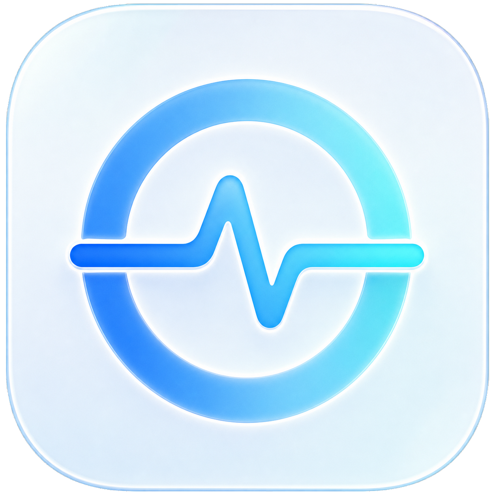
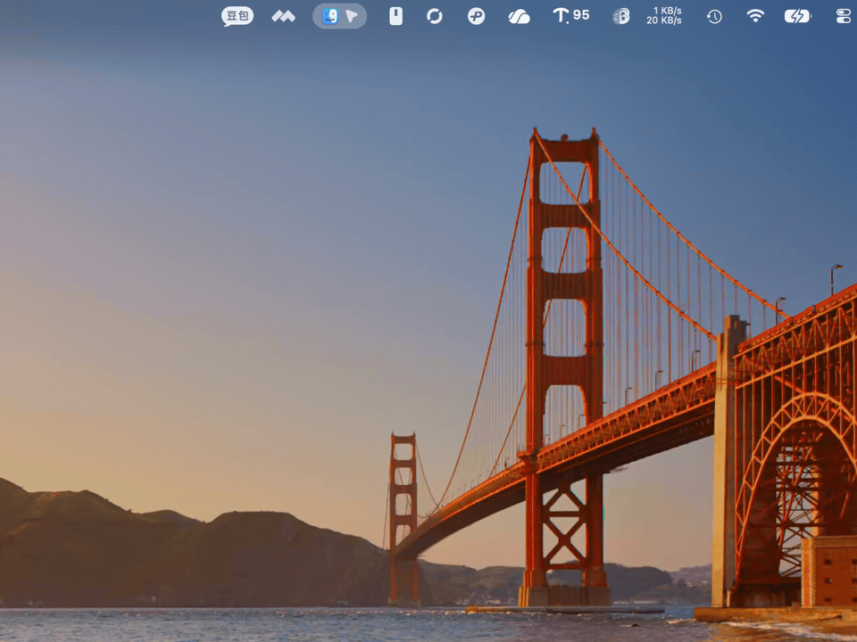

<p align="center">
  
</p>

<h1 align="center">NetHalo</h1>

<p align="center"><strong>Network speed, CPU, and memory — at a glance.</strong></p>

<p align="center">
  A lightweight native macOS menu bar monitor with a fixed-width meter,<br>
  no account, no telemetry, and no administrator helper.
</p>

<p align="center">
  <a href="https://github.com/kermars39-web/NetHalo/releases/latest/download/NetHalo-macOS-arm64.dmg"></a>
  <a href="https://kermars39-web.github.io/NetHalo/"></a>
</p>

<p align="center"><sub>macOS 13+ · Apple Silicon · MIT License</sub></p>

<p align="center">
  
</p>

<p align="center">
  <a href="#why-nethalo">Why NetHalo</a> ·
  <a href="#quick-start">Quick start</a> ·
  <a href="#privacy">Privacy</a> ·
  <a href="#简体中文">简体中文</a>
</p>

## Why NetHalo

- **A menu bar that stays readable.** Upload sits above download in a compact, fixed-width meter, so changing values do not shift the layout.
- **Details only when you ask.** One click reveals one-minute network, CPU, and memory trends plus switchable per-app rankings.
- **Real apps, not process noise.** NetHalo shows application icons and groups common helper processes under their parent app.
- **Native and quiet.** The interface is built with AppKit, has no third-party runtime dependencies, and avoids decorative motion in a high-frequency utility.

## Quick start

1. [Download the latest Apple Silicon DMG](https://github.com/kermars39-web/NetHalo/releases/latest/download/NetHalo-macOS-arm64.dmg).
2. Open the disk image and drag **NetHalo** into **Applications**.
3. On first launch, right-click NetHalo and choose **Open**.

The current build is ad-hoc signed and not notarized, which is why macOS requires the right-click step the first time. You can verify the download against the published [SHA-256 checksums](https://github.com/kermars39-web/NetHalo/releases/latest/download/SHA256SUMS.txt) or build the app from source below.

## Focused by design

NetHalo is for people who want the three essentials without turning the menu bar into a full hardware dashboard.

| NetHalo keeps close | NetHalo intentionally leaves out |
| --- | --- |
| Live upload and download speed | Temperature and private SMC access |
| CPU and memory trends | GPU power and fan control |
| Per-app network, CPU, and memory rankings | Privileged background helpers |
| User-initiated update checks | Accounts, telemetry, and automatic update polling |

## Privacy

NetHalo reads macOS system statistics locally. Overall network, CPU, and memory values refresh every second while the panel is open; per-app rankings use the system `nettop` and `ps` tools.

It does not upload monitoring or device data, inspect file contents, create an account, or install an administrator helper. NetHalo only contacts GitHub after you explicitly choose **Check for Updates** in Settings.

## Build from source

Building requires Swift 5.9 or later and the Xcode Command Line Tools.

```bash
git clone https://github.com/kermars39-web/NetHalo.git
cd NetHalo
./Scripts/build-app.sh
.build/release/NetHalo --self-test
open dist/NetHalo.app
```

The build script creates an ad-hoc signed app at `dist/NetHalo.app`.

## Contributing

Issues and pull requests are welcome. Please keep the interface compact, native, and calm; clarity should take priority over decorative animation.

If NetHalo earns a place in your menu bar, [starring the repository](https://github.com/kermars39-web/NetHalo) helps more Mac users find it.

## 简体中文

NetHalo 是一款轻量、原生的 macOS 菜单栏监控工具：用固定宽度双行显示实时上传和下载速度，点击后查看 CPU、内存、最近一分钟趋势及分应用排行。

- 原生 AppKit，不使用第三方运行时依赖
- 无账号、无遥测、无数据上传、无管理员辅助程序
- 数字变化时菜单栏宽度不抖动
- 显示真实应用图标，并归并常见 Helper 进程
- 只在用户主动检查更新时访问 GitHub

下载安装：[Apple Silicon DMG](https://github.com/kermars39-web/NetHalo/releases/latest/download/NetHalo-macOS-arm64.dmg)。支持 macOS 13 及以上版本。当前版本采用临时签名，首次启动请将 NetHalo 拖入“应用程序”，再右键选择**打开**。

## License

NetHalo is available under the [MIT License](LICENSE). See the [changelog](CHANGELOG.md) for release history.
